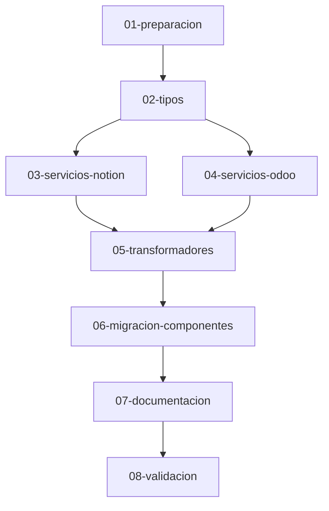

# Plan de Refactorización del Proyecto

> **Proyecto:** GenZai CMS - Headless CMS con Notion + Odoo
> **Versión del Plan:** 1.0.0
> **Fecha de Creación:** 2025-12-11
> **Status:** Pendiente de Aprobación

---

## 📋 RESUMEN EJECUTIVO

Este proyecto es un **CMS Headless híbrido** que utiliza:
- **Notion** como backend para gestión de Personas y contenido estructurado
- **Odoo** como backend para Encuestas (Surveys) y funcionalidades empresariales
- **N8N** como middleware para sincronización y automatización entre sistemas

### Objetivo de la Refactorización

Alinear la arquitectura del proyecto con las mejores prácticas definidas en el template `nextjs-headless-template-notion.md`, manteniendo la funcionalidad dual con Notion y Odoo, y generando documentación comprehensiva.

---

## 🎯 PROBLEMAS IDENTIFICADOS

### 1. Estructura de Carpetas
- ❌ No sigue la estructura recomendada del template
- ❌ Todo está en `app/` en lugar de usar `src/` como separación lógica
- ❌ Los "libs" deberían ser "services" estructurados por responsabilidad

### 2. Organización de Tipos
- ❌ Tipos raw de Notion API mezclados con tipos del frontend
- ❌ Tipos de Odoo en archivos separados sin convención clara
- ❌ No existe `types.d.ts` global para tipos comunes
- ❌ Duplicación de definiciones de tipos

### 3. Capa de Servicios
- ❌ Los servicios actuales mezclan responsabilidades
- ❌ No hay separación clara entre:
  - Cliente de API
  - Operaciones de database/pages
  - Transformadores
  - Lógica de negocio
- ❌ Los servicios de Notion y Odoo no están organizados de forma simétrica

### 4. Transformadores
- ❌ Helpers de transformación dispersos en utils
- ❌ No hay transformadores centralizados y reutilizables
- ❌ Falta consistencia en la transformación de datos

### 5. Documentación
- ❌ **No existe carpeta `Specs/`**
- ❌ No hay documentación de arquitectura
- ❌ No hay documentación de tipos
- ❌ No hay guías de integración
- ❌ No hay onboarding para desarrolladores

### 6. Configuración
- ❌ No hay configuración centralizada de entorno
- ❌ Faltan configuraciones en `next.config.ts` para optimización

---

## 🏗️ ARQUITECTURA OBJETIVO

```
genzai-cms-nextjs-notion-odoo/
├── src/
│   ├── app/                          # Next.js App Router
│   │   ├── (home)/
│   │   ├── personas/
│   │   ├── surveys/
│   │   └── api/
│   │
│   ├── components/                   # Componentes React
│   │   ├── shared/                   # Globales (Header, Footer, etc.)
│   │   ├── personas/                 # Específicos de Personas
│   │   └── surveys/                  # Específicos de Surveys
│   │
│   ├── services/                     # Servicios de backend
│   │   ├── notion/                   # Integración con Notion
│   │   │   ├── index.ts              # Exportaciones públicas
│   │   │   ├── client.ts             # Cliente Notion SDK
│   │   │   ├── database.ts           # Queries a databases
│   │   │   ├── pages.ts              # Operaciones con páginas
│   │   │   ├── blocks.ts             # Obtener bloques (contenido)
│   │   │   ├── transformers.ts       # Transformación Notion → Frontend
│   │   │   └── types.ts              # Tipos RAW de Notion API
│   │   │
│   │   ├── odoo/                     # Integración con Odoo
│   │   │   ├── index.ts
│   │   │   ├── client.ts             # Cliente Odoo (JSON-RPC)
│   │   │   ├── surveys.ts            # Operaciones con Surveys
│   │   │   ├── transformers.ts       # Transformación Odoo → Frontend
│   │   │   └── types.ts              # Tipos RAW de Odoo API
│   │   │
│   │   └── n8n/                      # Integración con N8N (opcional)
│   │       ├── index.ts
│   │       ├── client.ts
│   │       └── webhooks.ts
│   │
│   ├── config/                       # Configuración
│   │   └── env.ts                    # Variables de entorno validadas
│   │
│   └── utils/                        # Utilidades puras
│       ├── formatters.ts
│       └── validators.ts
│
├── types.d.ts                        # Tipos globales del frontend
│
├── Specs/                            # Documentación técnica
│   ├── README.md
│   ├── architecture/
│   │   ├── project-structure.md
│   │   ├── notion-integration.md
│   │   └── odoo-integration.md
│   ├── types/
│   │   ├── notion-types.md
│   │   ├── odoo-types.md
│   │   └── frontend-types.md
│   ├── api-integration/
│   │   ├── notion-api.md
│   │   └── odoo-api.md
│   ├── guides/
│   │   ├── styles-conventions.md
│   │   └── data-flow.md
│   └── Onboarding/
│       ├── README.md
│       ├── 01-getting-started.md
│       ├── 02-project-overview.md
│       ├── 03-notion-setup.md
│       ├── 04-odoo-setup.md
│       └── 05-development-workflow.md
│
└── [archivos de configuración]
```

---

## 📊 FASES DE IMPLEMENTACIÓN

La refactorización se divide en **8 fases secuenciales**:

| Fase | Nombre | Descripción | Archivos Afectados |
|------|--------|-------------|-------------------|
| **01** | Preparación y Análisis | Crear estructura base de carpetas | ~5 carpetas nuevas |
| **02** | Reorganización de Tipos | Separar tipos RAW vs Frontend | ~8 archivos |
| **03** | Servicios de Notion | Reestructurar integración Notion | ~6 archivos |
| **04** | Servicios de Odoo | Reestructurar integración Odoo | ~5 archivos |
| **05** | Transformadores | Centralizar transformación de datos | ~3 archivos |
| **06** | Migración de Componentes | Mover y actualizar imports | ~20 archivos |
| **07** | Documentación | Generar Specs/ completa | ~15 archivos MD |
| **08** | Validación y Limpieza | Testing y eliminación de código viejo | Todo el proyecto |

### Orden de Ejecución



---

## 🎯 BENEFICIOS ESPERADOS

### 1. Mantenibilidad
- ✅ Estructura clara y predecible
- ✅ Separación de responsabilidades
- ✅ Código más legible y documentado

### 2. Escalabilidad
- ✅ Fácil agregar nuevas integraciones (más databases de Notion, más modelos de Odoo)
- ✅ Componentes reutilizables
- ✅ Servicios independientes

### 3. Developer Experience
- ✅ Documentación comprehensiva en Specs/
- ✅ Onboarding claro para nuevos desarrolladores
- ✅ Types autocompletado mejorado

### 4. Performance
- ✅ Optimización de imports
- ✅ Code splitting mejorado
- ✅ ISR configurado correctamente

### 5. Type Safety
- ✅ Tipado completo y correcto
- ✅ Separación clara entre tipos de API y tipos de UI
- ✅ Menos errores en runtime

---

## ⚠️ CONSIDERACIONES IMPORTANTES

### Durante la Refactorización
1. **No romper funcionalidad existente**: Cada fase debe mantener la app funcional
2. **Commits atómicos**: Un commit por fase completada
3. **Testing continuo**: Validar después de cada fase
4. **Backup**: Crear branch antes de iniciar

### Riesgos Identificados
- 🔴 **Alto**: Cambios en imports masivos (Fase 06)
- 🟡 **Medio**: Transformadores pueden introducir bugs si no se validan bien
- 🟢 **Bajo**: Documentación no afecta código

### Mitigación
- Mantener versiones antiguas temporalmente
- Tests manuales después de cada fase
- Revisar TypeScript errors en cada paso

---

## 📅 ESTIMACIÓN DE TIEMPO

| Fase | Complejidad | Tiempo Estimado | Archivos Modificados |
|------|-------------|----------------|---------------------|
| 01   | Baja        | 30 min         | ~0 (crear folders) |
| 02   | Media       | 1-2 horas      | ~8 archivos |
| 03   | Alta        | 2-3 horas      | ~10 archivos |
| 04   | Alta        | 2-3 horas      | ~8 archivos |
| 05   | Media       | 1 hora         | ~4 archivos |
| 06   | Alta        | 2-3 horas      | ~25 archivos |
| 07   | Media       | 2-3 horas      | ~15 archivos MD |
| 08   | Baja        | 1 hora         | Testing |

**Total Estimado:** 12-17 horas

---

## 📝 ARCHIVOS DEL PLAN

Cada fase tiene su propio archivo detallado con instrucciones específicas:

1. `01-preparacion-y-analisis.md` - Crear estructura base
2. `02-reorganizacion-tipos.md` - Separar tipos RAW vs Frontend
3. `03-servicios-notion.md` - Reestructurar servicios de Notion
4. `04-servicios-odoo.md` - Reestructurar servicios de Odoo
5. `05-transformadores.md` - Centralizar transformadores
6. `06-migracion-componentes.md` - Migrar componentes y actualizar imports
7. `07-documentacion.md` - Generar documentación completa
8. `08-validacion-limpieza.md` - Validación final y limpieza

---

## ✅ CRITERIOS DE ACEPTACIÓN

La refactorización se considerará completa cuando:

- [ ] Toda la estructura sigue el template definido
- [ ] Tipos RAW y Frontend están completamente separados
- [ ] Servicios de Notion y Odoo están organizados simétricamente
- [ ] Transformadores están centralizados y documentados
- [ ] Toda la documentación en `Specs/` está completa
- [ ] No hay errores de TypeScript
- [ ] La aplicación compila sin warnings
- [ ] Todas las funcionalidades existentes siguen funcionando
- [ ] Tests manuales pasados

---

## 🚀 PRÓXIMOS PASOS

1. **Revisar y aprobar** este README y todos los archivos de fases
2. **Crear branch** para la refactorización: `git checkout -b refactor/architectural-alignment`
3. **Ejecutar Fase 01** siguiendo `01-preparacion-y-analisis.md`
4. Continuar secuencialmente con cada fase

---

**Nota:** Este plan ha sido generado siguiendo las mejores prácticas definidas en `nextjs-headless-template-notion.md` y adaptado a la realidad dual de este proyecto (Notion + Odoo).
